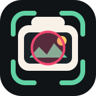

<p align="center">
  
</p>

<h1 align="center">Retake</h1>

<p align="center">
  Recreate iconic anime, film, TV, and historical locations with camera overlays today, then spatial reconstruction tomorrow.
</p>

<p align="center">
  <a href="https://github.com/yvonshong/Retake/actions/workflows/build-ios.yml"></a>
  
  
  
</p>

## Overview

Retake is a location-recreation camera app for anime pilgrimage, film tourism, historical photo matching, and scene-based travel photography.

The current iOS MVP helps users reproduce a reference scene in the real world. Users choose a screenshot, film still, or old photo, place it as a translucent overlay above the live camera preview, adjust the opacity, align the perspective, and capture a clean photo without the overlay.

The longer-term vision is more ambitious: Retake will evolve into an immersive spatial experience where anime, movie, and TV show locations can be scanned, reconstructed, aligned with source media, and explored as complete 3D worlds.

## Why Retake

Most location-matching tools stop at a single frame. Retake starts there, but the product direction is to move beyond one screenshot or one camera angle.

Future versions are planned to use Android XR, SLAM, computer vision, point cloud processing, 3D reconstruction, Gaussian Splatting, and generative AI so users can scan a real-world place and see media scenes reconstructed in spatial context. Instead of only matching the original frame, users should be able to walk around the scene, discover new viewpoints, and capture photos or videos that were never shown in the source material.

## Current Features

- Reference image selection from the system photo library.
- Full-screen live camera preview.
- Translucent image overlay for scene alignment.
- Real-time opacity control from 0% to 100%.
- 37% default overlay opacity for practical visual matching.
- Photo capture without burning the overlay into the final image.
- Saving captured photos to the system photo library.
- Dark mode friendly SwiftUI interface.

## Demo Flow

1. Open Retake.
2. Select a reference image, such as an anime screenshot, movie still, or archival photo.
3. Enter the camera overlay screen.
4. Adjust opacity until the reference and real-world scene are both visible.
5. Move the phone to match the original composition.
6. Capture and save the recreated photo.

## Roadmap

| Phase | Focus | Status |
| --- | --- | --- |
| 1 | iOS scene-matching camera with reference overlay, opacity control, capture, and save | In progress |
| 2 | Better 2D retake tools: pan, zoom, rotate, guides, history, favorites, sharing | Planned |
| 3 | Spatial capture foundation: real-world scanning, pose tracking, anchoring, point clouds | Planned |
| 4 | Generative scene reconstruction from anime, film, TV, and historical media | Planned |
| 5 | Android XR immersive exploration with walkable reconstructed scenes | Planned |

## Spatial Vision

Retake is designed around a future where media locations become explorable spaces:

- Scan real-world locations with Android XR glasses.
- Build a 3D map of the surrounding environment.
- Align the scanned space with anime, movie, TV, or historical scenes.
- Use generative AI to fill missing scene details.
- Reconstruct virtual characters, buildings, props, and environmental elements.
- Explore scenes from new viewpoints instead of recreating only the original shot.
- Capture spatial photos and videos that blend real travel with reconstructed media worlds.

This direction builds on autonomous driving, SLAM, 3D mapping, point cloud processing, and Gaussian Splatting experience, with Android XR as the target platform for spatial computing and on-location storytelling.

## Tech Stack

### Current iOS App

- SwiftUI
- AVFoundation
- PhotosUI
- Photos framework
- iOS 16.0+
- Xcode project generated from `project.yml`

### Planned Spatial Stack

- Android XR
- SLAM and visual-inertial tracking
- Point cloud processing
- 3D reconstruction
- Gaussian Splatting (3DGS)
- Generative AI scene completion
- Computer vision based media-to-location alignment

## Repository Structure

```text
.
├── .github/workflows/build-ios.yml
├── docs/logo.svg
├── PRD.md
├── README.md
├── project.yml
├── Retake/
│   ├── AppDelegate.swift
│   ├── CameraModel.swift
│   ├── CameraOverlayView.swift
│   ├── CameraPreviewView.swift
│   ├── ContentView.swift
│   ├── Info.plist
│   ├── RetakeApp.swift
│   └── ZoomControlView.swift
└── Retake.xcodeproj/
```

## Requirements

- macOS with Xcode installed.
- iOS 16.0+ deployment target.
- A physical iPhone is recommended for camera testing.
- XcodeGen is optional, only needed when regenerating the Xcode project from `project.yml`.

## Build

Open the project in Xcode:

```bash
open Retake.xcodeproj
```

Build from the command line:

```bash
xcodebuild \
  -project Retake.xcodeproj \
  -target Retake \
  -configuration Debug \
  -destination 'generic/platform=iOS Simulator' \
  CODE_SIGNING_ALLOWED=NO \
  build
```

Regenerate the Xcode project from `project.yml`:

```bash
xcodegen generate
```

## CI

GitHub Actions builds the iOS app on every push to `main` or `master`, every pull request, and manual workflow dispatch.

Workflow: [Build iOS](https://github.com/yvonshong/Retake/actions/workflows/build-ios.yml)

## Permissions

Retake requests the following permissions:

- Camera access for taking recreated photos.
- Photo library access for selecting reference images.
- Photo library add access for saving captured photos.

## Product Document

The original product requirements document is available in [PRD.md](PRD.md).

## Status

Retake is currently an early MVP. The iOS app implements the first camera overlay workflow, while the spatial reconstruction and Android XR experience are planned as future milestones.
